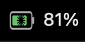

<div align="center">

# 🔋 Claude Usage Battery

**Your remaining Claude Code usage, displayed as a battery — right next to your system battery.**


*macOS (menu bar) · Windows / Linux (system tray) · installable via `pip`/`pipx`*

</div>

---

## Table of Contents
- [What is it](#what-is-it)
- [How it looks](#how-it-looks)
- [How the data works (and privacy)](#how-the-data-works-and-privacy)
- [Requirements](#requirements)
- [Installation](#installation)
  - [A · pipx (recommended)](#a--pipx-recommended)
  - [B · pip in a virtualenv](#b--pip-in-a-virtualenv)
  - [C · double-click installer](#c--double-click-installer)
- [Auto-start](#auto-start)
  - [When you launch Claude Code (`claude` in the terminal)](#when-you-launch-claude-code-claude-in-the-terminal)
  - [At system startup](#at-system-startup)
- [Configuration](#configuration)
- [Updating the app](#updating-the-app)
- [Sharing with others](#sharing-with-others)
- [Uninstallation](#uninstallation)
- [Troubleshooting (FAQ)](#troubleshooting-faq)
- [How it works (technical details)](#how-it-works-technical-details)
- [Project structure](#project-structure)
- [Notes and limitations](#notes-and-limitations)
- [License](#license)

---

## What is it
`Claude Usage Battery` is a small app that lives in your computer's status bar and shows — as a battery icon — **how much of your Claude Code usage is left**. The fill level and color represent the **5-hour window** (the one that determines when tokens are renewed). The **Claude logo** sits at the center so you can distinguish it at a glance from the system battery.

Clicking the icon shows the details: used/remaining percentage and a **countdown to reset**, for both the **5-hour** and **weekly** windows.

## How it looks

<div align="center">

</div>

| Level | Color | Meaning |
|:-----:|:-----:|:--------|
| ≥ 50% | 🟢 green  | You're good |
| 20–49% | 🟠 yellow | Watch out, you're burning through it |
| < 20% | 🔴 red  | Almost depleted, reset incoming |

The percentage is also shown as a number next to the icon (e.g. `42%`).
The app refreshes itself every **30 seconds**.

## How the data works (and privacy)
This percentage **is not stored in any local file**: Claude Code retrieves it by calling an Anthropic endpoint with your login token. The app does exactly the same thing:

1. Reads your **local OAuth token** — from the **Keychain** on macOS (entry `Claude Code-credentials`), or from `~/.claude/.credentials.json` on Windows/Linux.
2. Calls `GET https://api.anthropic.com/api/oauth/usage` (the same endpoint used by the `/usage` command).
3. If the token has expired, it **renews it automatically** and retries.

> 🔒 **Your token never leaves your computer.** It is only used to talk to `api.anthropic.com`, just like Claude Code already does. No data is sent to third parties. You only need to have **logged into Claude Code at least once**.

## Requirements
- **Python 3.9+**
- **Claude Code** installed and logged in
- macOS, Windows or Linux with a status bar / system tray

---

## Installation

### A · pipx (recommended)
`pipx` installs the app in an isolated environment and creates the global command `claude-battery`. It's the cleanest approach.

```bash
# 1) install pipx if you don't have it
python3 -m pip install --user pipx
python3 -m pipx ensurepath      # then reopen your terminal

# 2) install the app (choose ONE source)
pipx install git+https://github.com/MicheleDaniele/claude-usage-battery   # from GitHub
pipx install ./claude_usage_battery-1.0.0-py3-none-any.whl                # from .whl file
pipx install claude-usage-battery                                         # if on PyPI

# 3) launch
claude-battery
```

### B · pip in a virtualenv
```bash
python3 -m venv .venv
source .venv/bin/activate                 # Windows: .venv\Scripts\activate
pip install git+https://github.com/MicheleDaniele/claude-usage-battery
claude-battery
```

### C · double-click installer
If you'd rather not touch the terminal, after downloading the project:
- **macOS** → double-click **`install-mac.command`**
- **Windows** → right-click **`install-windows.ps1`** → *Run with PowerShell*
  (or `powershell -ExecutionPolicy Bypass -File install-windows.ps1`)

The installers create the environment, install the dependencies **and** configure auto-start at login.

---

## Auto-start
You can tie the battery to Claude in two ways (not mutually exclusive).

### When you launch Claude Code (`claude` in the terminal)
Every time you open a Claude Code session — by typing `claude` in the terminal, opening the IDE or the app — the battery starts automatically, thanks to a **`SessionStart` hook** in `~/.claude/settings.json`:

```json
{
  "hooks": {
    "SessionStart": [
      { "hooks": [ { "type": "command", "command": "claude-battery &" } ] }
    ]
  }
}
```

> If you installed from the local folder, the command can point to `launch-mac.sh` instead of `claude-battery`: they do the same thing. The hook is **idempotent**, so it never starts two icons.

### At system startup
The installers (Option C) take care of this: a *LaunchAgent* on macOS (`~/Library/LaunchAgents/com.claude.usagebattery.plist`) or a shortcut in the *Startup* folder on Windows.

---

## Configuration
Settings are constants at the top of each file, easy to change:

| Setting | Where | Default |
|---------|-------|---------|
| Refresh interval | `menubar_mac.py` / `tray_windows.py` → `REFRESH_SECONDS` | `30` (seconds) |
| Green/yellow/red color thresholds | `usage_core.py` → `level_color()` | `50` / `20` |
| Icon size and proportions | `battery_icon.py` → `draw_battery()` | — |

---

## Updating the app
After modifying the code:

```bash
cd ~/Desktop/ClaudeUsageBattery
# if using pipx from the local folder:
python -m build                                   # rebuilds dist/*.whl
pipx install ./dist/claude_usage_battery-1.0.0-py3-none-any.whl --force

# to update the GitHub repo:
git add . && git commit -m "description of change" && git push
```

Users who installed from GitHub can update with:
```bash
pipx upgrade claude-usage-battery
# or: pipx install git+https://github.com/MicheleDaniele/claude-usage-battery --force
```

---

## Sharing with others
From simplest to most involved:

1. **`.whl` file** — send `dist/claude_usage_battery-1.0.0-py3-none-any.whl`.
   The recipient runs: `pipx install ./claude_usage_battery-1.0.0-py3-none-any.whl`.
2. **GitHub link** — `pipx install git+https://github.com/MicheleDaniele/claude-usage-battery`.
3. **PyPI** (so anyone can just `pip install claude-usage-battery`). Requires a PyPI account and a token:
   ```bash
   pip install build twine
   python -m build
   twine upload dist/*
   ```

---

## Uninstallation
| Install method | How to remove |
|----------------|---------------|
| pipx | `pipx uninstall claude-usage-battery` |
| macOS installer | `launchctl unload ~/Library/LaunchAgents/com.claude.usagebattery.plist && rm ~/Library/LaunchAgents/com.claude.usagebattery.plist` |
| Windows installer | Delete `ClaudeUsageBattery.lnk` from the *Startup* folder |
| Launch hook | Remove the `SessionStart` entry from `~/.claude/settings.json` |

---

## Troubleshooting (FAQ)

**I see `login?` / "Log in to Claude Code".**
No valid token was found: open Claude Code and log in at least once, then click *Refresh now* in the icon menu.

**"Update failed" appears occasionally.**
Normal: it's a momentary network hiccup or a temporary rate limit. The app keeps the last valid value and retries on the next cycle, automatically.

**The icon doesn't appear in the menu bar (macOS).**
Check the log: `cat /tmp/claude-usagebattery.log`. Make sure the app has permission to read the Keychain (macOS may ask for confirmation the first time).

**Two icons appear.**
You started two instances (e.g. from pipx and from the venv). Close one via the *Quit* menu; the launch hook prevents duplicates on subsequent starts.

**The percentages don't change.**
They only change when you consume or release tokens: if you're not using Claude, they stay stable until the window resets.

---

## How it works (technical details)
- **Language:** Python — a single shared core + two status-bar front-ends.
- **macOS:** [`rumps`](https://github.com/jaredks/rumps) for the menu bar.
- **Windows/Linux:** [`pystray`](https://github.com/moses-palmer/pystray) for the system tray.
- **Icon:** drawn with `Pillow` using super-sampling and downscaled with anti-aliasing; the Claude logo is a *stencil* overlaid with the charge line, keeping it legible at any percentage.
- **Endpoints used (Claude Code internals):**
  - Usage: `GET https://api.anthropic.com/api/oauth/usage`
    (header `Authorization: Bearer …`, `anthropic-beta: oauth-2025-04-20`)
  - Token refresh: `POST https://platform.claude.com/v1/oauth/token`
    (`grant_type=refresh_token`, Claude Code client id)
  - Response: `five_hour` and `seven_day`, each with `utilization` (percentage)
    and `resets_at` (ISO date).

## Project structure
```
ClaudeUsageBattery/
├── usage_core.py        # local token + usage call + refresh
├── battery_icon.py      # colored battery drawing with Claude logo
├── menubar_mac.py       # menu bar app (macOS, rumps)
├── tray_windows.py      # system tray app (Windows/Linux, pystray)
├── claude_battery.py    # entry point: `claude-battery` command
├── pyproject.toml       # pip package
├── install-mac.command  # installer + auto-start (macOS)
├── install-windows.ps1  # installer + auto-start (Windows)
├── launch-mac.sh        # idempotent launcher (used by the hook)
└── docs/preview.png     # preview image
```

## Notes and limitations
- The app uses **Claude Code internal endpoints**: reliable but **not officially documented**. If Anthropic changes them, a small update to `usage_core.py` may be needed.
- The values shown are the same as those from the `/usage` command.

## License
MIT — see the `license` field in `pyproject.toml`. Use and modify it freely.
